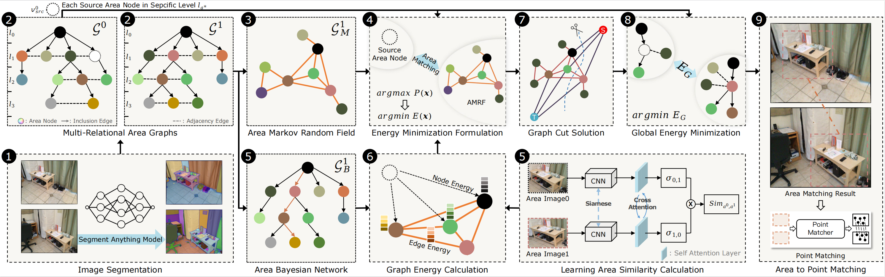

# A2PM-MESA
This is the official release of the code for the paper "MESA: Matching Everything by Segmenting Anything"

The code is under refactoring and will be released soon (expected in two months). Stay tuned!



# Citation
```bibtex
@InProceedings{Zhang_2024_CVPR,
    author    = {Zhang, Yesheng and Zhao, Xu},
    title     = {MESA: Matching Everything by Segmenting Anything},
    booktitle = {Proceedings of the IEEE/CVF Conference on Computer Vision and Pattern Recognition (CVPR)},
    month     = {June},
    year      = {2024},
    pages     = {20217-20226}
}
```