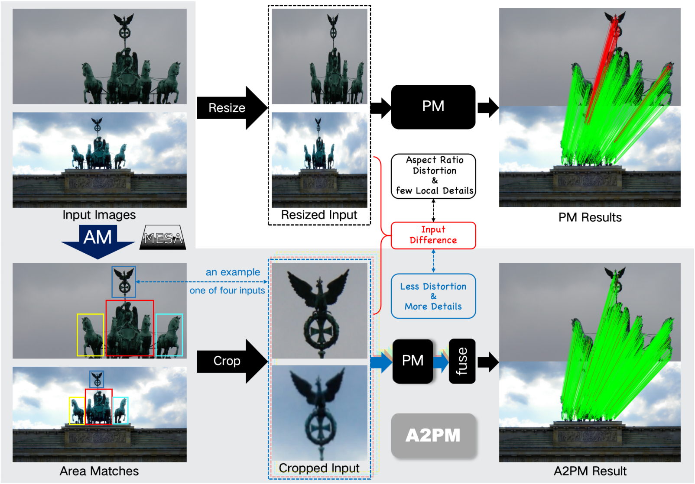

<!--
 * @Author: EasonZhang
 * @Date: 2024-07-26 15:03:49
 * @LastEditors: Easonyesheng preacher@sjtu.edu.cn
 * @LastEditTime: 2025-12-11 14:01:42
 * @FilePath: /A2PM-MESA/README.md
 * @Description: Readme
 * 
 * Copyright (c) 2024 by EasonZhang, All Rights Reserved. 
-->

<!-- add a image before title -->
<div align="center">
  </img>
  <h1>Area to Point Matching Framework </h1>
  <div style="display: flex; justify-content: center; gap: 10px;">
    <a href='https://arxiv.org/abs/2408.00279'></a> 
    <a href='https://cvl.sjtu.edu.cn/getpaper/1103'></a>
    <a href='https://www.bilibili.com/video/BV19BsFe5E6U/?spm_id_from=333.1365.list.card_archive.click&vd_source=a8ebbc42d41f0658cfa31f10414ec697'></a>
  </div>
</div>

---

> The family of Area to Point Matching, which is good at handling matching challenges like **large/various resolution images**, **large scale/viewpoint changes** and etc.



This is a user-friendly implementation of **Area to Point Matching** (A2PM) framework, powered by [hydra](hydra.cc).

It contains the implementation of [SGAM](https://arxiv.org/abs/2305.00194) (arXiv'23, [early-version-code](https://github.com/Easonyesheng/SGAM)), a training-free version of [MESA](https://openaccess.thecvf.com/content/CVPR2024/html/Zhang_MESA_Matching_Everything_by_Segmenting_Anything_CVPR_2024_paper.html) (CVPR'24, [project page](https://cvl.sjtu.edu.cn/getpaper/1103)) and [DMESA](https://ieeexplore.ieee.org/document/11300989) (TPAMI'25).

*Due to the power of hydra, the implementation is highly configurable and easy to **extend**.*

*It supports the implementation of feature matching approaches adopting the A2PM framework, and also enables the combination of new point matching and area matching methods.*


---
# Table of Contents
- [Table of Contents](#table-of-contents)
- [News](#news)
- [Qualitative Results of MESA and DMESA](#qualitative-results-of-mesa-and-dmesa)
  - [Continuous Matching of SGAM](#continuous-matching-of-sgam)
- [Installation](#installation)
  - [Clone the Repository](#clone-the-repository)
  - [Environment Creation](#environment-creation)
  - [Basic Dependencies](#basic-dependencies)
- [Usage](#usage)
- [Segmentation Preprocessing](#segmentation-preprocessing)
    - [Usage](#usage-1)
    - [SAM2](#sam2)
- [DEMO](#demo)
- [hydra-based Configuration](#hydra-based-configuration)
  - [Dataset](#dataset)
  - [Area Matching](#area-matching)
  - [Point Matching](#point-matching)
    - [MASt3R \& DUSt3R Configuration Notes](#mast3r--dust3r-configuration-notes)
  - [Match Fusion (Geometry Area Matching)](#match-fusion-geometry-area-matching)
  - [A2PM](#a2pm)
  - [Evaluation](#evaluation)
- [Benchmark Test](#benchmark-test)
  - [Expected Results of provided scripts](#expected-results-of-provided-scripts)
    - [Expected Results of DKM](#expected-results-of-dkm)
    - [Expected Results of MASt3R](#expected-results-of-mast3r)
    - [Expected Results of DUSt3R](#expected-results-of-dust3r)
    - [Expected Results of ELoFTR](#expected-results-of-eloftr)
    - [Results Notes](#results-notes)
- [Citation](#citation)
- [Acknowledgement](#acknowledgement)

---
# News
- 🎇 **2025-11-07**: Add the [MASt3R](https://github.com/naver/mast3r) mode for the area matching of DMESA and MESA-F, please refer to the [mast3r-dmesa-configs](https://github.com/Easonyesheng/A2PM-MESA/blob/main/conf/experiment/demo_dmesa_mast3r.yaml) and [mast3r-mesa-f-configs](https://github.com/Easonyesheng/A2PM-MESA/blob/main/conf/experiment/demo_mesaf_mast3r.yaml) to use. 
  - NOTE the MESA-f is relatively slow with MASt3R.
  - Use them in [this environment](#mast3r--dust3r-configuration-notes).
  - Overall, the generalization ability of MESA&DMESA has been significantly improved by the foundation model MASt3R.
- 🖖 **2025-09&10**: [MASt3R](https://github.com/naver/mast3r), [DUSt3R](https://github.com/naver/dust3r) and [ELoFTR](https://zju3dv.github.io/efficientloftr/) are supported. 
  - The expected results are provided in:
    - [Expected Results of MASt3R](#expected-results-of-mast3r)
    - [Expected Results of DUSt3R](#expected-results-of-dust3r) 
    - [Expected Results of ELoFTR](#expected-results-of-eloftr). 
  - The configuration notes are provided in [MASt3R \& DUSt3R Configuration Notes](#mast3r--dust3r-configuration-notes).
- 🎁 **2025-01-02**: An operation manual about running MESA on **Win11** has been added [here](https://github.com/Easonyesheng/A2PM-MESA/blob/main/assets/run_MESA_on_win11.md).
  - Thanks @[MY-QY](https://github.com/MY-QY)!

- 🕶️ **2024-11-03**: Add the wrapper for single image pair matching. See [here](#demo)

- 🪖 **2024-09-11**: [SAM2](https://github.com/facebookresearch/segment-anything-2) is supported in the segmentation preprocessing. See [here](#segmentation-preprocessing).

# Qualitative Results of MESA and DMESA


## Continuous Matching of SGAM
> from top to bottom: `SGAM`, `SGAM_ASpan`, `ASpan`.


---
# Installation
To begin with, you need to install the dependencies following the instructions below.

Check [this(中文版运行手册 on win11)](https://github.com/Easonyesheng/A2PM-MESA/blob/main/assets/run_MESA_on_win11.md) for running on Win11 also.

## Clone the Repository
```bash
git clone --recursive https://github.com/Easonyesheng/A2PM-MESA
# or if you have already cloned the repository
# git submodule update --init --recursive
cd A2PM-MESA
```

## Environment Creation
- We recommend using `conda` to create a new environment for this project.
```bash
conda create -n A2PM python==3.8
conda activate A2PM
```
## Basic Dependencies

- Install torch, torchvision, and torchaudio by running the following command.
  - Note the requirements of the torch version is soft, and the code is tested on `torch==2.0.0+cu118`.

  ```bash
  pip install torch==2.0.0+cu118 torchvision==0.15.1+cu118 torchaudio==2.0.1 --index-url https://download.pytorch.org/whl/cu118
  ```

- Install the basic dependencies by running the following command.
  ```bash
  pip install -r requirements.txt
  ```


---

# Usage
This code is based on [hydra](https://hydra.cc/), which is a powerful configuration system for Python applications. The documentation of hydra can be found [here](https://hydra.cc/docs/intro/).

> Please carefully read the following instructions to understand how to use this code with your own needs.

- If you wanna test your environment, you can turn to [DEMO](#demo) for a quick start, where we provide off-the-shelf configurations in `./conf/experiment/demo.yaml` and minimal input files in `./demo/` folder.

  - The code entry point is in `./scripts/demo.py`, where you can run the code with its configuration in `./conf/experiment/demo.yaml`.

- If you want to run the full pipeline, you can turn to [Benchmark Test](#benchmark-test); but you need to prepare SAM results for your datasets following the instructions in [Segmentation Preprocessing](#segmentation-preprocessing).

- If you want to dive into the code and develop your own matching methods based on this framework:
  - You first need to understand the basic logic of [hydra](https://hydra.cc/) we used: Initialize a python class with its configuration as a `yaml` file. We keep the names of `class-yaml` pairs consistent in the code.
  - Then, you can follow the instructions in [hydra-based Configuration](#hydra-based-configuration) to understand and configure every component of the A2PM framework.
  - Afterwards, you can also add new components by adding new classes and configurations in the corresponding folders.

# Segmentation Preprocessing
> The segmentation results are needed for the area matching methods.

- To use Segment Anything Model (SAM) for segmentation, we provide our inference code in `segmentor/`. To use it, you need to:
  - we provide a forked version of SAM in `./SAM/`, so do not forget to `git submodule update --init --recursive` to get the submodule. 
  - install the dependencies of SAM.
    - `cd segment-anything; pip install -e .`
    - `pip install opencv-python pycocotools matplotlib onnxruntime onnx`
  - [download](https://github.com/facebookresearch/segment-anything#model-checkpoints) and set the pre-trained model path in `segmentor/ImgSAMSeg.py#L34`.


### Usage
- See the `segmentor/sam_seg.sh` for image-level SAM segmentation.

### SAM2
- We also support the [SAM2](https://github.com/facebookresearch/segment-anything-2) model in the segmentation preprocessing. 
- Note the SAM2 seems to provide less masks than SAM, see the [issue](https://github.com/facebookresearch/segment-anything-2/issues/148), but it is faster anyway.
- Set `--sam_name SAM2` in `segmentor/sam_seg.sh` and config the model path in `segmentor/ImgSAMSeg.py#L48` to use it.
- If you encounter the `hydra` initialization error, add the following code in the `SAM2/sam2/__init__.py`:
    ```python
    from hydra.core.global_hydra import GlobalHydra
    GlobalHydra.instance().clear()
    ```
  


# DEMO
- We provide a demo script `scripts/demo.py` with corresponding configurations in `conf/experiment/demo.yaml`. You can run the script like:
  ```shell
  cd scripts
  python demo.py +experiment=demo
  ```
- We provide a set of demo images in `./demo/`, which are sampled from the ETH3D dataset. 
  - The SAM results must be provided in `./demo/samres`, if you want to use the SAM-based area matcher.
  - If no intrinsic camera parameters are provided, you should use `gam` as the `geo_area_matcher`, otherwise, you can use `egam`.
- Set the `geo_area_matcher: gam` in the `conf/experiment/demo.yaml` to use the original GAM, which can draw the matching results on the images.

- Some other `yaml` files starting with `demo_` in the `conf/experiment/` folder are also provided for you to test different area matchers and point matchers.
---


# hydra-based Configuration

In the following, we will introduce each components of this code with corresponding hydra configurations.

## Dataset
>We offer dataloaders for two widely-used datasets, including `ScanNet1500` and `MegaDepth1500`. 

- You can follow the instructions in [LoFTR](https://github.com/zju3dv/LoFTR) to download the datasets and set the paths in the configuration files in `conf/dataset/`.

- As our methods rely on the segmentation results, whose paths are also needed to be set in the configuration files in `conf/dataset/`. For example,
    - `sem_mode`: the segmentation method used, including `SAM`, `SEEM`, `GT`
    - `sem_folder`: path to the folder containing the segmentation results
    - `sem_post`: the file format of the segmentation results (For ScanNet, it is npy if using `SAM`, and png if using `SEEM` or `GT`)

- The segmentation process is discussed in [Segmentation Preprocessing](#segmentation-preprocessing).

- More datasets can be easily added by adding new dataloaders in `dataloader/` and setting the corresponding configurations in `conf/dataset/`.


## Area Matching
>Area matching is to establish semantic area matches between two images for matching reduandancy reduction, which is the core of the A2PM framework.

- We provide three area matchers, including: 
  - `Semantic Area Matching`(our method in [SGAM](https://arxiv.org/abs/2305.00194))
    - The implementation in `area_matchers/sem_am.py`.
    - The configuration in `conf/area_matcher/sem_area_matcher.yaml`. 
    - See also the repository [SGAM-code](https://github.com/Easonyesheng/SGAM).

  - `MESA-free`
    - A *training-free* version of [MESA](https://openaccess.thecvf.com/content/CVPR2024/html/Zhang_MESA_Matching_Everything_by_Segmenting_Anything_CVPR_2024_paper.html).
    - The implementation in `area_matchers/mesa.py`.
    - The configuration is in `conf/area_matcher/mesa-f.yaml`. 
    - The `MESA-free` eliminates the need for training the area similarity calculation module in MESA, and directly uses the off-the-shelf patch matching in ASpanFormer like DMESA.
    - The `MESA-free` is easier to use, but its performance is slightly lower than the original `MESA`.

  - `DMESA`
    - A dense counterpart of MESA proposed in [paper](https://arxiv.org/abs/2408.00279), more einfficient and flexible.
    - The implementation is in `area_matchers/dmesa.py`.
    - The configuration is in `conf/area_matcher/dmesa.yaml`. 


## Point Matching
> Point matching is to establish point matches between two (area) images.

- Here, we provide some point matchers, including: 
  - `Sparse`: {[SuperPoint+SuperGlue](https://github.com/magicleap/SuperGluePretrainedNetwork)}
  - `Semi-Dense`: {[ASpanFormer](https://github.com/apple/ml-aspanformer), [LoFTR](https://github.com/zju3dv/LoFTR), [ELoFTR](https://github.com/zju3dv/efficientloftr)}
  - `Dense`: {[DKM](https://github.com/Parskatt/DKM), [MASt3R](https://github.com/naver/mast3r), [DUSt3R](https://github.com/naver/dust3r)}


- Their configurations are put in `conf/point_matcher/`, with warppers in `point_matchers/`.

- For some of them, the inside paths need to be modified, which has been fixed in the submodules we provided in `point_matchers/`.
  - Use `​git clone --recursive` when you clone the repo.
  - Or use `git submodule update --init  --recursive` after direct clone.

- Before running, you need download the pre-trained models and put them in the corresponding paths in the configuration `yaml` files.

- More point matchers can be easily added by adding simialr wrappers.

### MASt3R & DUSt3R Configuration Notes
  1. DO NOT forget to run `git submodule update --init --recursive` to get the submodules in `reconer/mast3r/`.
     1. Need `git submodule update --init --recursive`  in the `reconer/mast3r/` folder to get `dust3r` and `dust3r/croco`.


  2. Note that the `mast3r` requires specific environment, please refer to its [repo](https://github.com/naver/mast3r) to create a new environment.
     1. After installation, run `pip install loguru hydra-core seaborn kornia yacs pytorch-lightning PyMaxFlow` in the `mast3r` conda environment. If there are more missing packages, please install them accordingly.
     2. Download the `MASt3R_ViTLarge_BaseDecoder_512_catmlpdpt_metric.pth` weights from [here](https://github.com/naver/mast3r?tab=readme-ov-file#mast3r-model) and set the path in `conf/point_matcher/mast3r.yaml#L2`, `conf/experiment/demo_dmesa_mast3r.yaml#L70` and `A2PM-MESA/conf/experiment/demo_mesaf_mast3r.yaml#L66`.
     3. Then, you can perform MESA/DMESA for `mast3r` and `dust3r`, like `cd ./scripts && python demo.py +experiment=demo_dmesa_mast3r`.

  3. For `mast3r`'s **Results**, see [here](#expected-results-of-mast3r); and for `dust3r`'s **Results**, see [here](#expected-results-of-dust3r).
     1. We use the weights provided in the `mast3r` repo: `MASt3R_ViTLarge_BaseDecoder_512_catmlpdpt_metric.pth` & `DUSt3R_ViTLarge_BaseDecoder_512_dpt.pth`.

## Match Fusion (Geometry Area Matching)

>We fuse matches from multiple inside-area point matching by the *geometry area matching* module. 

- The configuration is in `conf/geo_area_matcher/`.

- We provide two fusion methods, including:
  - original GAM proposed in [SGAM](https://arxiv.org/abs/2305.00194)
    - code in `geo_area_matcher/gam.py`
    - configuration in `conf/geo_area_matcher/gam.yaml`
  - a more effective GAM
    - code in `geo_area_matcher/egam.py`
    - configuration in `conf/geo_area_matcher/egam.yaml`

## A2PM

>The A2PM framework will combine the above components to form a complete feature matching pipeline.

- The implementation is in `scripts/test_a2pm.py`. You can run the shell script `scripts/test_in_dev.sh` to test the A2PM framework on a pair of images. 

- The pipeline configurations are set in `conf/experiment/*.yaml`. You can choose the one you want to use by setting the `+experiment=xxx.yaml` in the shell script.


## Evaluation

- We provide the evaluation code in `metric/`. The evaluation metrics include:
  - Pose estimation AUC
  - Mean Matching Accuracy
  - Area Matching Accuracy

- The `metric/instance_eval.py` is used to evaluate the instance-level matching results. It is used in `test_a2pm.py`.

- The `metric/eval_ratios.py` is used to evaluate the batch-level matching results. Set the paths in the `py` file and run it to get the evaluation results.

---

# Benchmark Test
You can run the benchmark test by running the shell script such as:

> **NOTE**: First, eval_ratios.py#L21~L26 (about the result path) need to be modified accordingly.

```shell
cd ./scripts
./dmesa-dkm-md.sh # DMESA+DKM on MegaDepth1500; named as {area-matcher}-{point-matcher}-{dataset}.sh

# check the metric results
# TODO: Merge into the same script
cd ../metric
python eval_ratios.py
# eval_ratios.py#L21~L26 need to be modified accordingly.
```

- You can change the configurations in the shell script to test different methods, i.e. `+experiment=xxx`.
- Also, modify the path in `eval_ratios.py#L21` (`${exp_root_path}/res`, `exp_root_path` in shell scripts) and folder name in `eval_ratios.py#L24` (the folder where results are saved) to get the evaluation results.

## Expected Results of provided scripts

***NOTE:*** The following expected results are achieved before GAM debug in version 200e33af8192308fff5ee1055280334b7aa3befd, so there may be slight differences if you run the code after this [commit](https://github.com/Easonyesheng/A2PM-MESA/tree/200e33af8192308fff5ee1055280334b7aa3befd), where the `alpha_list` parameters should be modified accordingly.

### Expected Results of DKM
- Take DKM as an example, the expected results are as follows:
- Config. files: 
  - `conf/experiment/a2pm_dmesa_egam_dkm_megadepth.yaml`
  - `conf/experiment/a2pm_dmesa_egam_dkm_scannet.yaml`
  - `conf/experiment/a2pm_mesa_egam_dkm_megadepth.yaml`
  - `conf/experiment/a2pm_mesa_egam_dkm_scannet.yaml`

|SN1500($640\times480$)|DKM|MESA-free+DKM|DMESA+DKM|
|:---:|:---:|:---:|:---:|
|Pose AUC@5 | 30.26 | 31.64 | 30.96 |
|Pose AUC@10 | 51.51 | 52.80 | 52.41 | 
|Pose AUC@20 | 69.43 | 70.08 | 69.74 |

|MD1500($832\times832$) | DKM | MESA-free+DKM | DMESA+DKM |
|:---:|:---:|:---:| :---:|
|Pose AUC@5 | 63.61 | 63.85 | 65.65 |
|Pose AUC@10 | 76.75 | 77.38 | 78.46 | 
|Pose AUC@20 | 85.72 | 86.47 | 86.97 |

### Expected Results of MASt3R
- We use $512\times512$ images for MASt3R, as it is trained on this resolution.
- Config. files: 
  - `conf/experiment/a2pm_dmesa_egam_mast3r_megadepth.yaml`
  - `conf/experiment/a2pm_dmesa_egam_mast3r_scannet.yaml`
  - `conf/experiment/a2pm_mesa_egam_mast3r_megadepth.yaml`
  - `conf/experiment/a2pm_mesa_egam_mast3r_scannet.yaml`

|SN1500($512\times512$)|MASt3R|MESA-free+MASt3R|DMESA+MASt3R|
|:---:|:---:|:---:|:---:|
|Pose AUC@5 | 28.25 | 32.79 | 34.23 |
|Pose AUC@10 | 51.01 | 55.13 | 56.23 | 
|Pose AUC@20 | 69.69 | 72.60 | 73.42 |

|MD1500($512\times 512$) | MASt3R | MESA-free+MASt3R | DMESA+MASt3R |
|:---:|:---:|:---:| :---:|
|Pose AUC@5 | 46.34 | 53.98 | 57.58 |
|Pose AUC@10 | 63.02 | 69.99 | 72.00 | 
|Pose AUC@20 | 76.50 | 81.80 | 82.86 |

### Expected Results of DUSt3R
- We use $512\times512$ images for DUSt3R, as it is trained on this resolution.
- Config. files: 
  - `conf/experiment/a2pm_dmesa_egam_dust3r_megadepth.yaml`
  - `conf/experiment/a2pm_dmesa_egam_dust3r_scannet.yaml`
  - `conf/experiment/a2pm_mesa_egam_dust3r_megadepth.yaml`
  - `conf/experiment/a2pm_mesa_egam_dust3r_scannet.yaml`


|SN1500($512\times512$)|DUSt3R|MESA-free+DUSt3R|DMESA+DUSt3R|
|:---:|:---:|:---:|:---:|
|Pose AUC@5 | 15.84 | 20.72 | 23.01 |
|Pose AUC@10 | 32.69 | 39.14 | 42.89 | 
|Pose AUC@20 | 49.36 | 56.62 | 60.86 |

|MD1500($512\times 512$) | DUSt3R | MESA-free+DUSt3R | DMESA+DUSt3R |
|:---:|:---:|:---:| :---:|
|Pose AUC@5 | 15.99 | 25.94 | 24.48 |
|Pose AUC@10 | 33.69 | 44.04 | 42.37 | 
|Pose AUC@20 | 53.51 | 61.83 | 61.04 |

### Expected Results of ELoFTR
- We use $640\times480$ images for ELoFTR, as it is trained on this resolution.
- We use the official pre-trained model provided in the [repo](https://github.com/zju3dv/efficientloftr).
- Only ScanNet1500 is tested here.
- Config. files: 
  - `conf/experiment/a2pm_dmesa_egam_eloftr_scannet.yaml`
  - `conf/experiment/a2pm_mesa_egam_eloftr_scannet.yaml`

|SN1500($640\times480$)|ELoFTR|MESA-free+ELoFTR|DMESA+ELoFTR|
|:---:|:---:|:---:|:---:|
|Pose AUC@5 | 22.15 | 23.62 | 23.07 |
|Pose AUC@10 | 41.08 | 42.37 | 41.66 | 
|Pose AUC@20 | 57.91 | 58.66 | 58.27 |


### Results Notes
- In this evaluation code, we fix the random seed to '2' (see `scripts/test_a2pm.py`), which is different from the settings in our paper (without fixing the random seed). Thus, the results are slightly different from the results in the paper for DMESA, but the effectiveness of our methods is consistent.

- The training-free version of MESA showcases a slight precision drop comprared with MESA (paper verison), but it still improves the baseline performance.

- Also, the parameters in the configuration files are set to the default values. Due to the complexity of the parameter settings, we have not tuned the parameters for all AM+PM combinations. 
  - Better results can be achieved by tuning the parameters for specific datasets and tasks. 
  - However, the default parameters are enough to show the effectiveness of our methods.

---

# Citation
If you find this work useful, please consider citing:

```bibtex
@article{SGAM,
  title={Searching from Area to Point: A Hierarchical Framework for Semantic-Geometric Combined Feature Matching},
  author={Zhang, Yesheng and Zhao, Xu and Qian, Dahong},
  journal={arXiv preprint arXiv:2305.00194},
  year={2023}
}
```

```bibtex
@InProceedings{MESA,
    author    = {Zhang, Yesheng and Zhao, Xu},
    title     = {MESA: Matching Everything by Segmenting Anything},
    booktitle = {Proceedings of the IEEE/CVF Conference on Computer Vision and Pattern Recognition (CVPR)},
    month     = {June},
    year      = {2024},
    pages     = {20217-20226}
}
```
```bibtex
@ARTICLE{dmesa,
  author={Zhang, Yesheng and Shen, Shuhan and Zhao, Xu},
  journal={IEEE Transactions on Pattern Analysis and Machine Intelligence}, 
  title={MESA: Effective Matching Redundancy Reduction by Semantic Area Segmentation}, 
  year={2025},
  volume={},
  number={},
  pages={1-18},
  doi={10.1109/TPAMI.2025.3644296}}

```


# Acknowledgement
We thank the authors of the following repositories for their great works:
- [SAM](https://github.com/facebookresearch/segment-anything)
- [SuperPoint+SuperGlue](https://github.com/magicleap/SuperGluePretrainedNetwork)
- [ASpanFormer](https://github.com/apple/ml-aspanformer)
- [LoFTR](https://github.com/zju3dv/LoFTR)
- [DKM](https://github.com/Parskatt/DKM)
- [SGAM](https://github.com/Easonyesheng/SGAM)
- [MASt3R](https://github.com/naver/mast3r)
